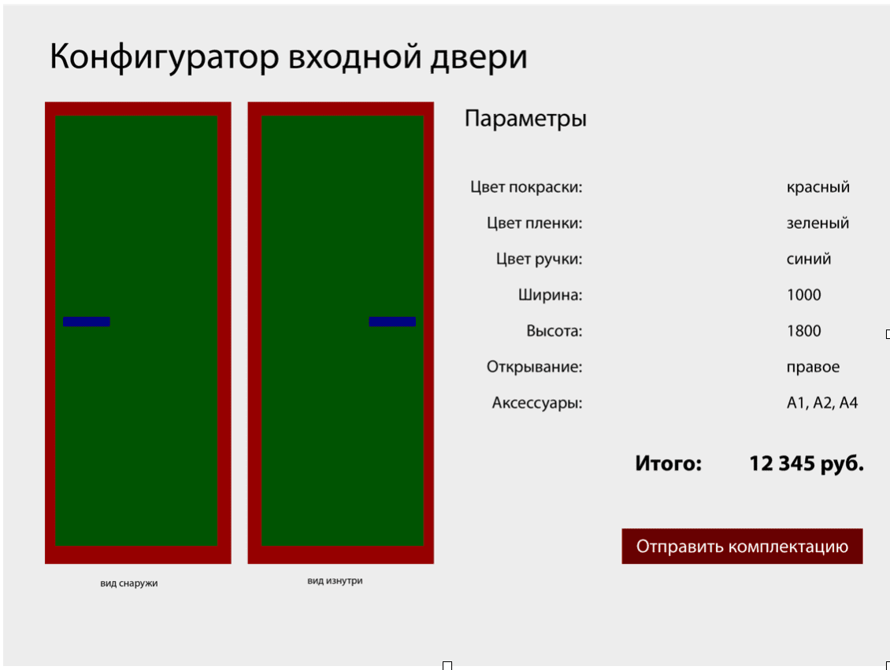

Тестовое задание Fullstack разработчика
Нужно сделать “легкий” аналог конфигуратора https://config.dverifalko.ru/?k
 

 
Визуальная часть
Слева визуальное представление двери;
Справа варианты вбора параметров;
Под параметрами кнопка “Отправить комплектацию”.

Выбор цветов ограничиваем стандартными вариантами (красный, синий, зеленый, желтый)
У всех параметров кроме “Аксессуаров” можно выбрать только одно значение. У “Аксессуаров” можно выбрать несколько (но на визуальной части двери их никак не нужно представлять).
У каждого значения параметра есть своя цена (она суммируется в итоговую сумму после заполнения всех параметров.
При смене параметра “Открывание” вид снаружи и изнутри должны “зеркалиться”.

После выбора всех параметров появляется цена и кнопка “Отправить комплектацию”.
По клику комплектация сохраняется на сервере в БД, так же на сервере генерируется pdf файл с описанием конфигурации и визуальным представлением двери (если чувствуете, что сложно сгенерировать визуальное представление на сервере, тогда добавляйте только таблицу параметров и стоимость), этот pdf файл отправляется сообщением (именно вложенным файлом) в Телеграм.
Техническая часть
Верстка “резиновая” с адаптивом под мобильные, по представленному прототипу выше. По желанию можно проявить творчество и “преукрасить” прототип;
Front-end стек значения не имеет;
Back-end стэк PHP (версия не новее 7.4) + MySQL (версия 5.5). Будет большим плюсом если сможете показать навыки владения ООП, а так же сделаете документацию с описанием классов, переменных, методов и функций;
Все параметры (названия и цены) хранятся в БД, там же хранятся все настройки;
Генерация PDF файла должна выполняться на сервере. В файле должна быть представлена таблица с выбранными параметрами и итоговой ценой. Снизу добавляется итоговая “дилерская” цена, она определяется путем умножения итоговой цены на коэффициент, который так же задается в параметрах (в БД). Если сможете в pdf файл добавить визуальное представление двери - это будет большим плюсом для вас.
Все отправленные комплектации так же хранятся в БД. Должна быть возможность по запросу заново сформировать pdf файл любой комплектации и отправить в Телеграм.
Для проекта нужно использовать любую систему контроля версий svn или git (можно использовать github или gitlab).

Рузультат работы нужно разместить на тестовом хостинге (либо собственном, либо попросить у нас сделать тестовый сервер)
